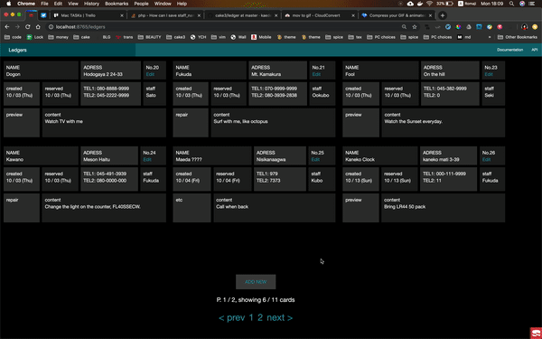

# ledger app
## Why I made this
* I hate paper work. 
* In workplace, when recieving works, making many many many 
work cards and notebooks, 
* Managing these paper cards and notes are painful, and 
slow, generating mistakes.
* I am making this for eliminate paperwork. v(^ ^)v  

## UI
### Response Design
* work in PC and Tablet and Smart phones!!


### Basic CRUD system
* Create your work card
* View your work cards list
* Edit your work cards list



### DB Design
https://miro.com/welcomeonboard/4xn6z63A4oGh00U02gFSqcDbqlIJdyEF3xp5ILzrjFVuFUWZkRt7PMBYu0enXYlr

### Add Page Design
* Not yet
### Find Cards System
* Not yet, use browser finder menu
### Deployment 
* Not yet

## DB
db: fesa, table: ledgers, Ledgers,
```cakephp
bin/cake bake migration createLedgers \
customer_name:string[64] \
customer_adress:text \
customer_tel1:string[64] \
customer_tel2:string[64] \ staff_id:int \
work_category:int \
content:text \
created:date \
reserved:date \
modified:date \
```
```cakephp
bin/cake bake migration \
RemoveStaff_idFromLedgers;
bin/cake bake migration \
AddStaff_nameFromLedgers staff_name:string;

bin/cake bake migration \
RemoveWork_categoryFromLedgers;
bin/cake bake migration \
AddWork_categoryFromLedgers work_category:string;
```

```cakephp
bin/cake migrations migrate 
bin/cake bake all ledgers
```
* I bake wrong table name, `ledges`
I have to make sh file to delete all.
### to delelte
```
src/
    Controller/
        HogesController.php
    Model/
        Entity/
            Hoge.php
        Table/
           HogesTable.php
    Template/
        Hoges/
            add.ctp
            edit.ctp
            index.ctp
            view.ctp

```
```sh
# if you baked wrong table name
# $1 to uppercase
rm -ri Model/Entity/Hoge.php
....
```
* this column `staff_id` make
```php
$this->paginate = [
    'contain' => ['Staffs']
];
```
in Ctrllr, but this need to delete.  
Do same in add,edit,

I can print ledger now.
basic crud is done.


### to do
restrict staff to 0 - 3 select.

0 to Statham  
1 to Jason bourne  
2 to Yamada  

vi template/ledgers/add.ctp

change table int to str: done

I want to allow null for every categories

### err
* cannot pass id from index to edit
```
Notice (8): Undefined variable: ledger 
[APP/Template/Ledgers/edit.ctp, line 20]

in edit.ctp Line 20:
<?= $this->Form->create($ledger) ?>
add, edit is err.
No $ledger ???
```
#### in edit
I forgot curd..
```
if ($this->request->is(['patch', 'post', 'put'])) {
    $ledger = $this->Ledgers->patchEntity(
        $ledger, $this->request->getData());
    if ($this->Ledgers->save($ledger)) {
        $this->Flash->success(
            __('The ledger has been saved.'));

        return $this->redirect(
            ['action' => 'index']);
    }
    $this->Flash->error(
        __('The ledger could not be saved.'));
}
// POST
$this->set(compact('ledger'));
```

#### other view func
```
public function edit() {
    $id = $this->request->query['id'];
    $entity = $this->People->get($id); #
    $this->set('entity', $entity);
}
```
primary key null


## index
public function index(){
    $ledgers = $this->paginate($this->Ledgers);
    $this->set(compact('ledgers'));
}
// take arr from this-ledgers 
// and pass by set compact.
or 
$this->Ledgers->find('all'));
```php
<?php foreach ($ledgers as $ledger): ?>
<?= h($ledger->customer_name) ?>
```
select values by for each
and print each ledger.
## problem 
what is $ledger?
-> sent by controller.

## add
public function add() {
    $ledger = $this->Ledgers->newEntity();
    if ($this->request->is('post')) {
        $ledger = $this->Ledgers->patchEntity(
            $ledger, $this->request->getData());
        if ($this->Ledgers->save($ledger)) {
            $this->Flash->success(
                __('The ledger has been saved.'));

            return $this->redirect(
                ['action' => 'index']);
        }
        $this->Flash->error(
            __('The ledger could not be saved.'));
    }
    $this->set(compact('ledger'));
}

## date obj
```php
$ledger->created
// 10/3/19
$ledger->created->format('Y-M-D')
// 2019-Oct-Thu
$ledger->created->format('Y-m-d')
// 2019-10-03
$ledger->created->format('H:i:s')
// 00:00:00 ??? why???
$ledger->created->format('m/d D')
// 2019-10-03
```
## CSS
https://www.carnaghan.com/knowledge-base/disabling-the-layout-and-the-view-in-cakephp/
* this will not work in add.ctp
```css
$this->set('defaultCss', false);
```
* So try this
```css
$this->layout = false;
```
